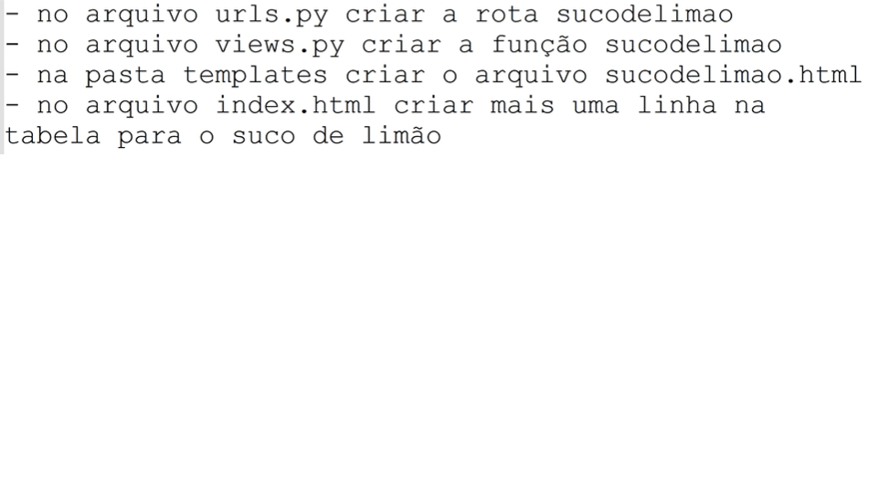

# PersonalCheff
 APP para gerenciamento de receitas

 <!---Esses são exemplos. Veja https://shields.io para outras pessoas ou para personalizar este conjunto de escudos. Você pode querer incluir dependências, status do projeto e informações de licença aqui--->


> Uma aplicação web de receitas chamada PersonalCheff desenvolvida durante o curso de Python no Senac Americana. A aplicação listará receitas e clicando em cada nome de receita você pode ver a receita completa.
### Lista de tarefas
Segue a lista de tarefas a serem desenvolvidas no projeto:
-1 [X] Pré-requisitos
    - [X] Instalar o Python
    - [X] Instalar Visual Studio Code
<br><br>
-2 [X] Criar e ativar o ambiente virtual
```
python -m venv .\venv\
venv\Scripts\activate
```
-3 [X] Instalar o Django
```
pip install Django
ou para versão especifica nesse caso a versão 3.2, python -m pip install django==3.2
```
-4 [X] Criar o projeto PersonalCheff
```
django-admin startproject PersonalCheffProj
ou para questão de permissão inserir o ".py" no django-admin.py ficando da seguinte forma, django-admin.py startproject PersonalCheffProj
```
-5 [X] Abri a pasta PersonalCheffProj e subir o servidor e testar o projeto
```
cd PersonalCheffProj
python manage.py runserver
```
-6 [X] Alterar o idioma do projeto no arquivo settings.py para `pt-br`
-7 [X] Alterar o timezome do projeto no arquivo settings.py para `America/Sao_Paulo` 
<br><br>
-8 [X] Criar o app receitas
```
python manage.py startapp receitas
```
-9 [X] Registrar e adicionar o nome do app "receitas" no ***`settings.py >> INSTALLED_APPS`***
-10 [X] Adicionar arquivo urls.py no app receitas e Configurar a rota inicial do arquivo `urls.py`
-11 [x] Criar a `view` para rota inicial
-12 [x] Registrar a rota inicial
-13 [x] Dentro da pasta receitas(app), crie a pasta `templates`
-14 [x] Crie seus arquivos HTML  dentro da pasta templates do app 'receitas', começando pelo arquivo `index.hmtl`
-14.1 [x] No arquivo `views.py` que está dentro da paste do app `realize a seguite alteração para renderizar o arquivo index.html`:
    ```python
        from django.shortcuts import render

        def index(request):
            return render(request, 'index.html')
    ```
-14.2 [x] Crie o arquivo `sucodelaranja.hmtl`, dentro da pasta templates do app 'receitas'
-14.3 [x] No arquivo `views.py` que está dentro da paste do app `inclua a função que irá renderizar o arquivo sucodelaranja.html`:
    ```python
        def sucodelaranja(request):
            return render(request, 'sucodelaranja.html')
    ```

***!!ADICINAL IMPORANTE!!!! <br>
PADRÃO PARA CRIAR AS PÁGINAS (MODEL/VIEW/TEMPLATE) ITEM 14 CITADO ACIMA.*** <br>


-15 [x] <br>
    -Integrar arquivos estáticos (CSS, JS, IMG)
    - Dentro da pasta do projeto (PersonaCheffProj), criar a pasta `static` <br>
    -Dentro da pasta static, colocar as imagens, os arquivos CSS e Javascript (JS) conforme for utilizando. <br>
    -No arquivo `settings.py` realize a importação da biblioteca `import os` <br>
    -`No settings.py, menu TEMPLATES, submenu DIRS configure o caminho conforme abaixo e crie os menus STATIC_ROOT e  STATICFILES_DIRS:` <br>

    'DIRS': [os.path.join(BASE_DIR, 'receitas/templates')]

    STATIC_ROOT = os.path.join(BASE_DIR, 'static')

    STATICFILES_DIRS = [os.path.join(BASE_DIR, 'PersonalCheffProj/static')]

   -Execute o comando no terminal `python manage.py collectstatic` para organizar as pastas e arquivos CSS/JS/IMG automaticamente. <br><br> 
    -Na primeira linha dos arquivos seus arquivos HTML que possuirem arquivo státicos inclua sempre ``.
    -Insira imagem utilizando o comando, exemplo: `. 

-16 [x] Utilizando links
    -Para criar um link para página index, independente de onte você esteja utilize o comando `url`:
    
    <a href=""> Voltar </a>

-17 [x] Criando o `base.html` para otimizar o padrão de layout 
    -Na pasta `templates` crie o arquivo `base.html`. Esse arquivo irá conter todo codigo de estrutura comum as páginas. Nesse aquivo deve ficar tudo que tiver antes do `body` e tudo que estiver depois do `body`.<br>
    -Nesse arquivo deve conter no inicio da página o ``.<br>
    -nesse arquivo, no local onde será carregado o contúdo das outras páginas utilizando os delimitadores `` e ``.<br>
    -O código será algo semelhante ao exemplo abaixo:
    
    
    
    

    

    <h1>PersonalCheff</h1>
    <h2>Receita de suco de laranja</h2>
    <h2>Modo de preparo</h2>
    <ul>
        <li>Lave a Laranja</li>
        <li>Esprema a laranja</li>
        <li>Adoce a gosto</li>
    </ul>

    <a href=""> Voltar </a>

    
    

-18 [x] Separando em partials.<br>
    -Criar uma pasta chamada `partials` dentro da pasta tamplates<br>
    -Dentro da pasta partials, crie os arquivos q serão as ** partes globais** utilizadas no seus projeto como: `header.html`, `footer.html`, `side_bar.html`, `banner.html`, etc.  No nosso exemplo criamos as partials `header e footer`.<br>
    -Insira em cada um dos arquivos os códigos correspondentes, exemplo: No arquivo `header.html` eu insiro todo conteudo que desejo que seja representado no meu cabeçalho da minha aplicação. ***OBS: sempre inserir o ***<br>
    -Para inserir as partials no arquivo de destino utilizamos o comando `include` da seguinte maneira: ``

-19 [x] Renderizando dados dinamicamente

-Trocar as informações fixas no arquivo html por informações dinâmicas vindas do arquivo python.<br>
-Quero gerar a lista de receitas de foram dinâmica, vamos fazer isso utilizando o recurso do Django que passa uma informação para minhas templates(.html) através da passagem de uma parâmetro no comando render que está em minha view(.py):<br>
return render(request,'index.html', {'nome_da_receita':'suco de laranja'})<br>
-Observer que passei através do comando render um dicionário para a template. Na minha template(index.html) eu posso exibir o conteúdo desse dicionário da seguinte forma:
    
    <td>
        {{nome_da_receita}}</td>

-Vale a pena diferenciar o uso de {{ }} e :<br>
        
    {{ }} é utilizado normalmente para exibir o valor de variáveis, para mostrar informação em tela<br><br>
     é utilizado para o processamento de informações, usamos esses delimitadores quando precisamos de if ou forpor exemplo.

-20 [x] Criando um dicionario com as receitas<br>
-No arquivo views.py vamos criar um dicionário com as receitas, modifique a função index da seguinte forma:<br>
    def index(request):
        receitas = {
            1:'Suco de Melão',
            2:'Pizza',
            3:'Suco de Limão',
        }
        
        dados = {
            'lista_receitas' : receitas
        }
    return render(request,'index.html', dados)

-na template index.html, eu faço um laço de repetição que verifique cada item da lista de receitas à cada passagem do laço:<br>
    ```

    ```
        <tr>
            <td>
                
                {{uma_receita}}
            </td>
            <td>https://www.youtube.com/watch?v=Nn9140bDPnc</td>
            <td><a href="" class="btn btn-info">Ver receita completa</a></td>
        </tr>
     
    <br>
-para o processamento da inforção sem que haja a exibição, `muitas vezes utilizados com if e for`.

-21 [x] Criando o banco de dados(MySQL/MariaDB)<br>
    -Abra o Xammp e start os serviços do Apache e MySQL<br>
    -Click no botão Admin do Apache<br>
    -Acesse o Link PHPAdmin<br>
    -Dentro do PHPMyadmin, click no botão `novo` para criar o banco de dados, insira no nome do seu app no caso nosso `personalcheff_db`.<br><br>

-22 [x] Instalando o conector do bando de dados MySQL<br>
    -Pip install mysqlclient

-23 [x] Configurar a coenxão com mysql <br>
    -No arquivo settings.py, no local `DATABASES`, aproximadamente na linha 77 configurar a conexão para o seu banco de dados como no exemplo:

        'default': {
        'ENGINE': 'django.db.backends.mysql',
        'NAME': 'personalcheff_bd',
        'USER': 'root',
        'PASSWORD': '',
        'HOST': 'localhost',
        'PORT': '3306',
        }

-24 [x] Criando o modelo da receita
    -Um modelo é a representação das tabelas no banco de dados. Cada classe em uma models equivale a uma tabela.
    No arquivo `receita/models.py` crie a classe abaixo para representação da tabela de receitas.

        from django.db import models
        from datetime import datetime
        
        class Receitas(models.Model):
            nome_receita = models.CharField(max_length=100)
            video = models.CharField(max_length=80)
            modo_preparo = models.TextField()
            ingredientes = models.TextField()
            nota = models.IntegerField()
            data_receita = models.DateTimeField(default=datetime.now, blank=True)

-25 [x] Criando a migration (mapeamento)
    -Prepara todas as models criadas para serem migradas para o banco de dados.
    No terminal execute o seguinte comando:
    `Python manage.py makemigrations`

-26 [x] Realizando a migration
    -Para realizar a efetivação da tabela no banco de dados das tabelas preparadas anteriormente e as criadas pelo dajango utilize o seguinte comando:
    `Python manage.py migrate`

-27 [x] Criando um usuário para o ambiente administrativo
    -O Django já cria uma ambiente administrativo para nossa aplicação, ficando esse ambiente em: http://127.0.0.1:8000/admin/
    -Para utilizar o ambinte é necessario criar um Super user atraver do comando:
        `Python manage.py createsuperuser`

-28 [x] Registrando um modelo no admin
    -Para criar o módulo referente ao nosso APP no ambiente administrativo, precisamo registrar esses modelos no admin.
    -Abra o arquivo `receitas\admin.py` e registre seu modelo:

        ```
        from django.contrib import admin
        from .models import Receitas

        # Register your models here.
        admin.site.register(Receitas)
        ```

-29 [] Trazendo os dados do banco de dados

-30 [] Exibição das paginas individuais das receitas


<br><br>
## 📝 Licença
Esse projeto está sob licença. Veja o arquivo [LICENÇA](LICENSE.md) para mais detalhes.
[⬆ Voltar ao topo](#nome-do-projeto)<br>

